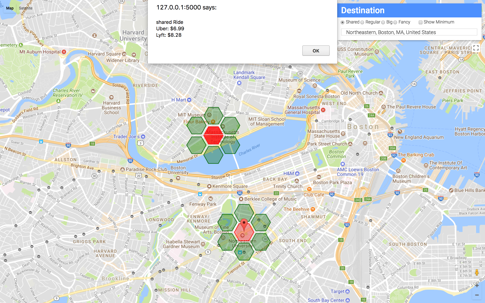

# hackMIT 2017 - Ride Fair

This hack compares the fare prices between Lyft and Uber to travel to a 
particular destination with the intent of minimizing the users travel costs. 

This hack uses a flask backend with an HTML + CSS front end and used a number of
freely available API's including API's from Google, Uber and Lyft. 

Link to [heroku app][1]

## Installation and Startup
All dependencies can be installed using the command `pip install -r requirements.txt`. 
```
source environment
flask run
```



# TODO:
- get API keys for gogole maps to allow this to work on heroku
- find work around for SSL connection preventing location services from working
- refactor codebase to OOD

[1]: https://http://ridefare.herokuapp.com/index.html
